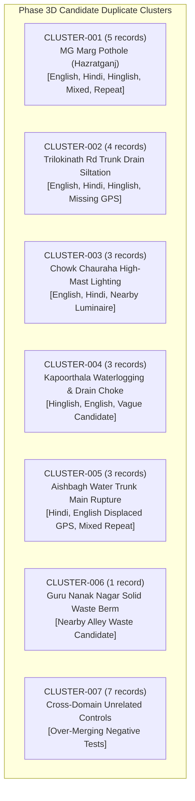

# CivicTrace Phase 3D: Synthetic Duplicate & Intelligence Evaluation Dataset

**Directory:** `data/lucknow/duplicates/`  
**Dataset File:** `duplicate_cases.csv`  
**Validation Suite:** `scripts/validate_duplicates.py`  
**Machine-Readable Report:** `duplicate_validation_report.json`  
**Technical Documentation:** `docs/phase3d_duplicates.md`  
**Status:** COMPLETE & FROZEN  

---

## 1. Purpose & Hackathon Positioning

The Phase 3D dataset provides a curated **Synthetic Ground-Truth Benchmark for Duplicate & Intelligence Evaluation** for the CivicTrace platform in Lucknow.

> [!IMPORTANT]
> **SYNTHETIC BENCHMARK STATUS**:
> This dataset is synthetic evaluation data created strictly for the **CivicTrace byteBuilt 1.0 hackathon MVP / prototype evaluation**. It must **not** be interpreted as a real citizen complaint database, official municipal records, or production telemetry.
>
> Every record is explicitly stamped:
> ```
> data_mode = SYNTHETIC_EVALUATION
> source_type = SYNTHETIC_EVALUATION
> ```
> No real citizen identities, personal data, phone numbers, fabricated government complaint IDs, or fake official responses are generated.

### Strategic Hackathon Positioning
> *"CivicTrace's hackathon MVP uses synthetic evaluation data to demonstrate the end-to-end intelligence workflow. The data model is designed so that synthetic records can later be replaced by real citizen reports, GIS data, authority records, and evidence after deployment and appropriate privacy/provenance controls."*

Controlled synthetic benchmark data provides deliberate stress-testing capabilities:
- Controlled ground truth to evaluate future machine learning models.
- Multilingual citizen complaint variations (English, Hindi, Hinglish, Mixed).
- Precise spatial proximity tolerances (offsets, drift, landmark references).
- Edge scenarios and negative controls to prevent over-merging.

---

## 2. Core Architectural Principles

### Core Principle 1: Curated Ground Truth vs. Algorithmic Prediction
This phase delivers **curated ground truth only**. It does **not** implement:
- Natural language processing (NLP) classifiers
- Embedding models / Vector databases
- Cosine similarity or semantic search
- Automated clustering or graph algorithms
- LLM prompt chains or automated duplicate mergers

The dataset represents the evaluation benchmark against which future intelligence components will be assessed:
$$\text{Synthetic Ground Truth} \longrightarrow \text{Future Intelligence Layer} \longrightarrow \text{Predicted Label} \longrightarrow \text{Benchmark Comparison}$$

### Core Principle 2: Cluster as Human Ground-Truth Grouping
In this benchmark, `cluster_id` represents a **human-curated ground-truth grouping** of complaints that relate to an underlying civic issue or candidate evaluation cluster. It is not an unsupervised algorithm cluster.

### Core Principle 3: Curated Confidence vs. AI Probability
The `curation_confidence` metric is a normalized float in the range `[0.0, 1.0]` representing human data curator confidence in the assigned relationship. It is **not** an AI confidence score or model probability.

### Core Principle 4: Relational Decoupling
- `incident_id`: Links the record to an underlying physical incident in `seed_incidents.csv` (or `UNKNOWN` if not seeded in Phase 3B).
- `reference_record_id`: The anchor record (`CT-DUP-xxx` or `CT-INC-xxx`) against which the pairwise duplicate relationship is evaluated.
- `duplicate_label`: The human-curated ground truth relationship between this record and `reference_record_id`.

---

## 3. Duplicate Label Definitions

The dataset uses a strict 4-value controlled vocabulary:

| Duplicate Label | Definition | Curated Operational Intent |
| :--- | :--- | :--- |
| `DUPLICATE` | Strong curated evidence that two records describe the **exact same underlying civic problem**. | Same physical defect, road segment, or utility asset; different wording, languages, or repeat reports. Safe to merge or group automatically. |
| `LIKELY_DUPLICATE` | Strong similarity exists, but **some minor uncertainty remains** (e.g., GPS drift ~30–75m, cross-corner coordinates). | High likelihood of describing the same problem; system can recommend merging with high confidence. |
| `POSSIBLE_DUPLICATE` | Meaningful similarities exist, but available information is **insufficient for confident merging** (e.g., missing GPS, landmark only, nearby separate asset). | Requires triage or human reviewer sign-off before merging; alerts system to avoid automatic over-merging. |
| `UNRELATED` | Complaints may share vocabulary, locality, issue category, or other superficial traits, but describe **different underlying problems**. | Negative control cases designed to test that intelligence models do **not** over-merge distinct complaints. |

---

## 4. Dataset Schema Specification (24 Columns)

The dataset `duplicate_cases.csv` strictly implements 24 columns in exact order:

| # | Column Name | Data Type | Nullable | Description & Constraints |
| :-: | :--- | :--- | :--- | :--- |
| 1 | `duplicate_record_id` | String | No | Unique record identifier (`CT-DUP-001` through `CT-DUP-026`). |
| 2 | `cluster_id` | String | No | Benchmark grouping identifier (`CLUSTER-001` through `CLUSTER-007`). |
| 3 | `incident_id` | String | No | Foreign key referencing `seed_incidents.csv` (`CT-INC-xxx`) or `UNKNOWN`. |
| 4 | `data_mode` | Enum | No | Controlled value: `SYNTHETIC_EVALUATION`. |
| 5 | `complaint_text` | String | No | Authentic citizen complaint text in English, Hindi, Hinglish, or Mixed. |
| 6 | `language` | Enum | No | Controlled vocabulary: `ENGLISH`, `HINDI`, `HINGLISH`, `MIXED`. |
| 7 | `issue_category` | Enum | No | Controlled domain category from Phase 3B taxonomy. |
| 8 | `issue_subcategory` | String | No | Descriptive subcategory characterizing the civic defect. |
| 9 | `latitude` | Float | Yes | WGS84 decimal latitude. Permitted empty only when `location_status = UNKNOWN`. |
| 10 | `longitude` | Float | Yes | WGS84 decimal longitude. Permitted empty only when `location_status = UNKNOWN`. |
| 11 | `location_status` | Enum | No | Controlled vocabulary: `APPROXIMATE`, `UNKNOWN` (prefer non-verified for synthetic data). |
| 12 | `ward_id` | String | No | Foreign key referencing `jurisdiction_registry.csv` (`WARD-xxx`) or `UNKNOWN`. |
| 13 | `zone_id` | String | No | Foreign key referencing `jurisdiction_registry.csv` (`ZONE-xx`) or `UNKNOWN`. |
| 14 | `asset_id` | String | No | Foreign key referencing `asset_ownership.csv` (`AST-...`) or `UNKNOWN`. |
| 15 | `authority_id` | String | No | Foreign key referencing Phase 1 lexicon (`AUTH-...`) or `NEEDS_REVIEW`. |
| 16 | `duplicate_label` | Enum | No | Controlled vocabulary: `DUPLICATE`, `LIKELY_DUPLICATE`, `POSSIBLE_DUPLICATE`, `UNRELATED`. |
| 17 | `duplicate_reason` | String | No | Human-curated ground truth rationale explaining the assigned label. |
| 18 | `reference_record_id` | String | No | Anchor record ID (`CT-DUP-xxx` or `CT-INC-xxx`). Must not self-reference. |
| 19 | `evidence_available` | Enum | No | Controlled vocabulary: `YES`, `NO`. |
| 20 | `source_type` | Enum | No | Controlled value: `SYNTHETIC_EVALUATION`. |
| 21 | `source_id` | String | No | Registered source ID (`SRC-xxx`) anchoring the evaluation scenario. |
| 22 | `source_reference` | String | No | Benchmark reference tag (e.g., `PHASE3D-SYNTHETIC-DUPLICATE-BENCHMARK: Scenario 1A`). |
| 23 | `curation_confidence` | Float | No | Human curator confidence score between `0.0` and `1.0`. |
| 24 | `notes` | String | No | Contextual notes documenting difficult cases and evaluation considerations. |

---

## 5. Candidate Duplicate Clusters & Scenario Coverage

The 26 records are organized into 7 underlying candidate clusters:



### Difficult Cases Matrix (10 Scenarios)

| # | Difficult Scenario Type | Example Record(s) | Benchmark Challenge |
| :-: | :--- | :--- | :--- |
| 1 | **Same issue, approximate location** | `CT-DUP-003` | GPS displaced ~35m due to smartphone sensor drift along arterial corridor. |
| 2 | **Same issue, different language** | `CT-DUP-002`, `CT-DUP-007`, `CT-DUP-011`, `CT-DUP-016` | Cross-lingual matching between Devanagari Hindi and English. |
| 3 | **Same issue, different wording** | `CT-DUP-001` | Lexical divergence: "crater-like pothole" vs "bituminous disintegration". |
| 4 | **Same locality, different issue** | `CT-DUP-020`, `CT-DUP-023` | Negative control: Pothole vs dark streetlight (<40m) in Hazratganj; electric pole hazard vs high-mast light in Chowk. |
| 5 | **Same wording, different locality** | `CT-DUP-021` | Negative control: "choked and overflowing drain" in Gomti Nagar vs Kaiserbagh (~4.2 km apart). |
| 6 | **Same issue reported after partial repair** | `CT-DUP-004` | Repeat complaint where loose gravel backfill washed away in monsoon shower. |
| 7 | **Duplicate candidate with insufficient evidence** | `CT-DUP-015` | Vague complaint ("waterlogged street near market") lacking intersection landmark. |
| 8 | **Two complaints appear duplicate but are separate** | `CT-DUP-012`, `CT-DUP-019` | Streetlight pole 140m down Victoria St; solid waste mound in side alley 120m away from market berm. |
| 9 | **Landmark reference instead of exact location** | `CT-DUP-005` | Complaint cites "Hazratganj crossing toward GPO" with ~110m spatial offset. |
| 10 | **Complaint with missing GPS** | `CT-DUP-008` | GPS coordinates empty; spatial routing must rely on textual street extraction. |

---

## 6. Over-Merging Prevention Scenarios (Negative Controls)

In municipal grievance systems, naive keyword or bounding-box matching causes severe false positives (merging distinct issues into single tickets). Phase 3D explicitly incorporates 7 negative control records (`CLUSTER-007`) where `duplicate_label = UNRELATED`:

1. **Locality Proximity Confusion**: `CT-DUP-020` (Streetlight out on MG Marg) evaluated against `CT-DUP-001` (Pothole on MG Marg). Proximity is <40m, but issues belong to completely different infrastructure domains and authorities (`AUTH-LMC` vs `AUTH-UPPWD`).
2. **Textual Template Confusion**: `CT-DUP-021` (Gomti Nagar drain) evaluated against `CT-DUP-006` (Kaiserbagh drain). Both share words "stormwater drain", "choked", "overflowing", but are separated by 4.2 km across different municipal zones.
3. **Overlapping Vocabulary Confusion**: `CT-DUP-022` (Aliganj water line leak) evaluated against `CT-DUP-013` (Aliganj storm waterlogging). Both occur in Ward 109 and mention "Aliganj", "road", and "water", but one is potable pipe maintenance under Jal Sansthan and the other is storm drainage under LMC Civil.
4. **Physical Asset Proximity Confusion (CONF-003)**: `CT-DUP-023` (MVVNL leaning utility pole) evaluated against `CT-DUP-010` (LMC high-mast streetlight). Both in Chowk, but involve distinct statutory bodies and hazard scopes.
5. **Diffuse Waste Cross-Zone Confusion**: `CT-DUP-024` (Chowk open dumping) evaluated against `CT-DUP-019` (Alambagh roadside garbage). Both report garbage piles, but separated by ~9 km across different zones.
6. **Underground Utility Confusion**: `CT-DUP-025` (Hazratganj sewer manhole surcharge) evaluated against `CT-DUP-016` (Aishbagh burst potable water main). Both report pipeline failures, but involve distinct sub-departments and locations.
7. **Cross-Jurisdictional Road Confusion**: `CT-DUP-026` (LDA Gomti Nagar road subsidence) evaluated against `CT-DUP-001` (PWD MG Marg pothole). Both involve caved-in asphalt, but in different development zones and maintenance jurisdictions.

---

## 7. Validation & Verification

The automated validation suite (`scripts/validate_duplicates.py`) runs 5 comprehensive audit passes:
- **Schema & Header Verification**: Verifies exactly 24 columns in canonical order.
- **Relational Integrity**: Audits all foreign keys against frozen Phase 1, Phase 2, 3A, and 3B registries.
- **Controlled Vocabularies**: Enforces strict enums across all categorical attributes.
- **Spatial Sanity**: Checks coordinate numeric validity and Lucknow geographic bounds.
- **Database Duplication vs Relationship**: Distinguishes intentional duplicate grievance reports from accidental duplicate CSV rows.

To run the suite:
```bash
python scripts/validate_duplicates.py
```
*Current Status*: **PASSED (0 Errors, 0 Warnings, 26 Records Audited)**.
