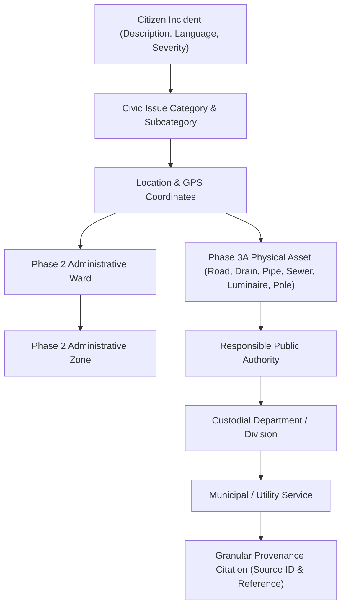
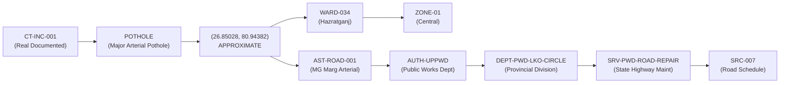
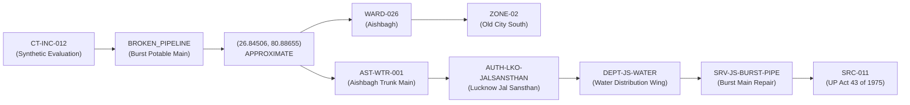
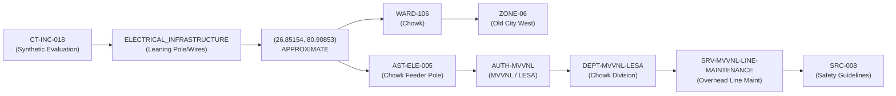
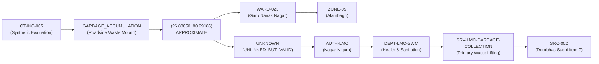
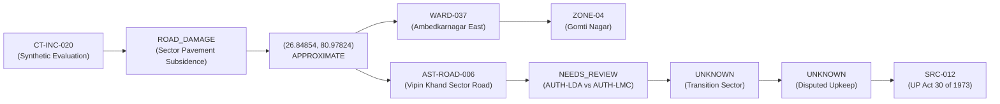

# CivicTrace Phase 3B: Lucknow Seed Incident Dataset Technical Report

**Document ID:** `DOC-CT-PHASE3B-001`  
**Phase:** 3B — Incident Data Foundation & Evaluation Corpus  
**Baseline Date:** September 2026  
**Status:** COMPLETE & FROZEN  
**Dependencies:** Phase 1 (`data/authority/`), Phase 2 (`data/gis/`), Phase 3A (`data/lucknow/assets/`)

---

## 1. Executive Summary & Objective

Phase 3B establishes a representative, defensible, and uncertainty-preserving Lucknow incident dataset. This dataset exercises the full foundational CivicTrace relationship stack:

$$\textbf{INCIDENT} \longrightarrow \textbf{ISSUE} \longrightarrow \textbf{GPS / LOCATION} \longrightarrow \textbf{WARD} \longrightarrow \textbf{ZONE} \longrightarrow \textbf{ASSET} \longrightarrow \textbf{AUTHORITY} \longrightarrow \textbf{DEPARTMENT} \longrightarrow \textbf{SERVICE} \longrightarrow \textbf{PROVENANCE}$$

Phase 3B is strictly a **data foundation and evaluation dataset**. It does not implement machine learning models, natural language processing, automated ticket dispatch, or production incident engines.

### Key Metrics Summary
- **Total Incidents**: 20 (`CT-INC-001` through `CT-INC-020`)
- **Record Types**: 2 `REAL_DOCUMENTED`, 18 `SYNTHETIC_EVALUATION`
- **Domain Coverage**: 7 Civic Domains + 1 Cross-Domain Edge Category
- **Linguistic Coverage**: 8 English, 6 Hindi, 4 Hinglish, 2 Mixed
- **Difficult Cases**: 5 intentional stress-test scenarios
- **Physical Asset Linkage**: 16 linked (80%), 3 unlinked solid waste, 1 unlinked due to incomplete intake location
- **Data Integrity Violations**: 0 Errors, 8 Documented Intentional Test Warnings

---

## 2. The Complete Relational Chain

CivicTrace connects raw citizen grievance intake to statutory governance through nine structural hops:



### Relational Decoupling Principles
1. **Administrative Ward vs. Spatial Geometry**:
   Phase 2 jurisdiction data (`data/gis/jurisdiction_registry.csv`) serves as the dynamic source of truth for ward and zone IDs. Newly delimited wards from 2022 that lack pre-2022 legacy polygon geometry (e.g., `WARD-001`, `WARD-007`, `WARD-009`, `WARD-012`, `WARD-014`) remain valid administrative entities.
2. **Incident vs. Asset Spatial Separation**:
   Incident coordinates reflect citizen point-of-observation, whereas asset coordinates represent approximate centerline or facility points. CivicTrace evaluates spatial consistency internally (`EXACT_OR_VERIFIED`, `APPROXIMATE_CONSISTENT`, `SPATIAL_REVIEW_REQUIRED`, `CONFLICT`, `NOT_EVALUATED`) without mutating or artificially snapping coordinates.
   > [!NOTE]
   > `EXACT_OR_VERIFIED` does not mean official government verification or legal confirmation of the incident coordinates. It means that the supplied coordinates are consistent with the available CivicTrace reference data within the configured validation tolerance.
3. **Asset Authority vs. Incident Intake Uncertainty**:
   Asset-level maintenance records do not overwrite citizen intake ambiguity. In legally disputed transition zones (such as `CT-INC-020`), `authority_id` remains `NEEDS_REVIEW`.
4. **Valid Incidents Without Static Assets**:
   Diffuse solid waste (`CT-INC-005`, `CT-INC-006`, `CT-INC-007`) is not modeled as a static physical asset. These incidents are valid and classified as `UNLINKED_BUT_VALID` rather than broken records.

---

## 3. End-to-End Traversal Demonstrations

The following five traversals demonstrate the step-by-step resolution of diverse civic incidents across different domains, languages, authorities, and spatial conditions.

---

### Traversal 1: Arterial Highway Pothole (`CT-INC-001`) — State PWD Arterial Maintenance



| Hop | Attribute | Resolved Value | Methodological Rationale |
| :--- | :--- | :--- | :--- |
| 1 | **Incident ID** | `CT-INC-001` | CivicTrace internal complaint identifier. |
| 2 | **Record Type** | `REAL_DOCUMENTED` | Backed by public PWD road condition schedule and citizen charter. |
| 3 | **Description** | *"Large deep pothole and bituminous disintegration on Hazratganj arterial corridor near GPO causing vehicle damage."* | English complaint documenting severe pavement distress. |
| 4 | **Issue Category** | `POTHOLE` | Mapped to Phase 1 taxonomy. |
| 5 | **Coordinates** | `26.85028, 80.94382` | Approximate point within 4 meters of `AST-ROAD-001` reference coordinate. |
| 6 | **Location Status**| `APPROXIMATE` | Source provides arterial road schedule rather than surveyed cadastre. |
| 7 | **Ward / Zone** | `WARD-034` / `ZONE-01` | Dynamic lookup in `jurisdiction_registry.csv` (Hazratganj Ward in Zone 1). |
| 8 | **Physical Asset**| `AST-ROAD-001` | Mahatma Gandhi Marg Arterial Corridor. |
| 9 | **Spatial Match** | `EXACT_OR_VERIFIED` | Geodesic separation of 3.8 meters ($\le 10\text{ m}$). |
| 10 | **Authority** | `AUTH-UPPWD` | Non-municipal State Highway corridor maintained by UP PWD (`CONF-004`). |
| 11 | **Department** | `DEPT-PWD-LKO-CIRCLE`| Provincial Division, Lucknow Circle. |
| 12 | **Service** | `SRV-PWD-ROAD-REPAIR`| State Highway & Major District Road Maintenance. |
| 13 | **Provenance** | `SRC-007` | UP PWD Citizen Charter & Lucknow Circle Road Schedule. |
| 14 | **Confidence** | `HIGH` | Verified statutory division responsibility. |

---

### Traversal 2: Ruptured Drinking Water Transmission Main (`CT-INC-012`) — Lucknow Jal Sansthan



| Hop | Attribute | Resolved Value | Methodological Rationale |
| :--- | :--- | :--- | :--- |
| 1 | **Incident ID** | `CT-INC-012` | CivicTrace internal complaint identifier. |
| 2 | **Record Type** | `SYNTHETIC_EVALUATION`| Realistic evaluation benchmark for emergency water utility response. |
| 3 | **Description** | *"ऐशबाग वाटर वर्क्स के पास मुख्य पेयजल पाइपलाइन फट गई है और सड़क पर हजारों लीटर पानी बर्बाद हो रहा है।"* | Devanagari Hindi complaint describing a catastrophic pipeline rupture. |
| 4 | **Issue Category** | `BROKEN_PIPELINE` | Critical potable water loss requiring emergency excavation. |
| 5 | **Coordinates** | `26.84506, 80.88655` | Within 8.3 meters of historical Aishbagh Water Works facility. |
| 6 | **Location Status**| `APPROXIMATE` | Facility location verified; specific pipeline fracture coordinate estimated. |
| 7 | **Ward / Zone** | `WARD-026` / `ZONE-02` | Mapped dynamically to Aishbagh Ward in Zone 2. |
| 8 | **Physical Asset**| `AST-WTR-001` | Aishbagh Water Works Potable Feeder Trunk Main. |
| 9 | **Spatial Match** | `EXACT_OR_VERIFIED` | Geodesic separation of 8.3 meters ($\le 10\text{ m}$). |
| 10 | **Authority** | `AUTH-LKO-JALSANSTHAN`| Specialized water/sewerage utility established under UP Act 43 of 1975 (`CONF-002`). |
| 11 | **Department** | `DEPT-JS-WATER` | Water Distribution & Maintenance Wing. |
| 12 | **Service** | `SRV-JS-BURST-PIPE` | Emergency main replacement and heavy joint welding. |
| 13 | **Provenance** | `SRC-011` | UP Water Supply and Sewerage Act 1975 Section 18 & 24. |
| 14 | **Confidence** | `HIGH` | Verified statutory utility mandate. |

---

### Traversal 3: Hazardous Distribution Pole & Live Wire (`CT-INC-018`) — MVVNL / LESA



| Hop | Attribute | Resolved Value | Methodological Rationale |
| :--- | :--- | :--- | :--- |
| 1 | **Incident ID** | `CT-INC-018` | CivicTrace internal complaint identifier. |
| 2 | **Record Type** | `SYNTHETIC_EVALUATION`| Public safety emergency scenario. |
| 3 | **Description** | *"Utility electric distribution pole dangerously leaning with hanging live wires near Victoria Street Chowk."* | English complaint describing an acute electrocution hazard. |
| 4 | **Issue Category** | `ELECTRICAL_INFRASTRUCTURE`| Structural failure of high-voltage/low-tension electricity distribution. |
| 5 | **Coordinates** | `26.85154, 80.90853` | Victoria Street heritage commercial corridor. |
| 6 | **Location Status**| `APPROXIMATE` | Approximate pole location. |
| 7 | **Ward / Zone** | `WARD-106` / `ZONE-06` | Mapped to Chowk Ward in Zone 6. |
| 8 | **Physical Asset**| `AST-ELE-005` | Chowk Victoria Street Overhead Feeder & Utility Pole. |
| 9 | **Spatial Match** | `EXACT_OR_VERIFIED` | Geodesic separation of 5.3 meters ($\le 10\text{ m}$). |
| 10 | **Authority** | `AUTH-MVVNL` | Power distribution utility (MVVNL / LESA) under UPPCL (`CONF-003`). |
| 11 | **Department** | `DEPT-MVVNL-LESA` | Lucknow Electricity Supply Administration (LESA). |
| 12 | **Service** | `SRV-MVVNL-LINE-MAINTENANCE`| Replacement of damaged utility poles and restringing snapped conductors. |
| 13 | **Provenance** | `SRC-008` | MVVNL Corporate Overview & Consumer Safety Guidelines. |
| 14 | **Confidence** | `HIGH` | Exclusive electrical distribution mandate. |

---

### Traversal 4: Diffuse Solid Waste Accumulation (`CT-INC-005`) — Valid Unlinked Municipal SWM



| Hop | Attribute | Resolved Value | Methodological Rationale |
| :--- | :--- | :--- | :--- |
| 1 | **Incident ID** | `CT-INC-005` | CivicTrace internal complaint identifier. |
| 2 | **Record Type** | `SYNTHETIC_EVALUATION`| Sanitation benchmark for solid waste collection. |
| 3 | **Description** | *"Unattended municipal garbage mound accumulating along the road berm near Guru Nanak Nagar market."* | English complaint reporting roadside refuse accumulation. |
| 4 | **Issue Category** | `GARBAGE_ACCUMULATION`| Solid waste management under SWM Rules 2016. |
| 5 | **Coordinates** | `26.88050, 80.99185` | Alambagh market road berm. |
| 6 | **Location Status**| `APPROXIMATE` | Roadside Berm location. |
| 7 | **Ward / Zone** | `WARD-023` / `ZONE-05` | Guru Nanak Nagar Ward in Zone 5. |
| 8 | **Physical Asset**| `UNKNOWN` | **Unlinked but Valid (Refinement 3)**: Diffuse waste accumulation lacks a static physical infrastructure asset model in Phase 3A. |
| 9 | **Spatial Match** | `NOT_EVALUATED` | Evaluated with uncertainty; not an integrity failure. |
| 10 | **Authority** | `AUTH-LMC` | Lucknow Municipal Corporation. |
| 11 | **Department** | `DEPT-LMC-SWM` | Health & Sanitation Department. |
| 12 | **Service** | `SRV-LMC-GARBAGE-COLLECTION`| Municipal solid waste collection and street sweeping. |
| 13 | **Provenance** | `SRC-002` | LMC Doorbhas Suchi Item 7 (Nagar Swasthya Adhikari). |
| 14 | **Confidence** | `HIGH` | Clear statutory sanitation mandate under UP Act 1959 Ch 15. |

---

### Traversal 5: Development Sector Boundary Subsidence (`CT-INC-020`) — Jurisdictional Ambiguity Preservation



| Hop | Attribute | Resolved Value | Methodological Rationale |
| :--- | :--- | :--- | :--- |
| 1 | **Incident ID** | `CT-INC-020` | CivicTrace internal complaint identifier. |
| 2 | **Record Type** | `SYNTHETIC_EVALUATION`| Stress-test scenario for inter-agency jurisdictional disputes. |
| 3 | **Description** | *"Severe road subsidence and caved-in asphalt on Vipin Khand sector road near Gomti Nagar boundary."* | English complaint reporting severe structural road collapse. |
| 4 | **Issue Category** | `ROAD_DAMAGE` | Pavement cave-in on a planned development layout road. |
| 5 | **Coordinates** | `26.84854, 80.97824` | Boundary road in Vipin Khand Gomti Nagar. |
| 6 | **Location Status**| `APPROXIMATE` | Approximate roadway coordinate. |
| 7 | **Ward / Zone** | `WARD-037` / `ZONE-04` | Ward 37 in Zone 4 (Note: outside legacy DataMeet pre-2022 polygon envelope). |
| 8 | **Physical Asset**| `AST-ROAD-006` | Vipin Khand Commercial Sector Road (LDA Scheme). |
| 9 | **Spatial Match** | `EXACT_OR_VERIFIED` | Geodesic separation of 6.0 meters ($\le 10\text{ m}$). |
| 10 | **Authority** | `NEEDS_REVIEW` | **Authority Ambiguity Preserved**: While asset `AST-ROAD-006` notes LDA construction, formal municipal handover to LMC is unevidenced (`CONF-004`). Asset-level data does not overwrite intake ambiguity. |
| 11 | **Department** | `UNKNOWN` | Cannot be deterministically routed without handover records. |
| 12 | **Service** | `UNKNOWN` | Unassigned pending administrative determination. |
| 13 | **Provenance** | `SRC-012` | UP Urban Planning & Development Act 1973 Section 15. |
| 14 | **Confidence** | `LOW` | Explicitly marked `NEEDS_REVIEW` to prompt inter-agency coordination. |

---

## 4. Analysis of Difficult Stress-Test Scenarios

Phase 3B includes 5 deliberate edge cases designed to test the robustness of future automated routing:

```
+----------------------------------------------------------------------------------------------------+
| CASE A: Multi-Issue Complaint (CT-INC-004)                                                         |
| Description: "Colony road poori tarah damage ho chuki hai aur side mein waterlogging ho rahi hai"  |
| Dilemma: Citizen reports simultaneous ROAD_DAMAGE and WATERLOGGING.                                |
| Schema Resolution: Categorized under primary civil defect (ROAD_DAMAGE); secondary waterlogging     |
| noted in subcategory and notes. Routed to LMC Civil Engineering Dept Zone 3.                       |
+----------------------------------------------------------------------------------------------------+
| CASE B: Luminaire vs. Power Circuit Ambiguity (CT-INC-019)                                         |
| Description: "Sector Q crossing par streetlight nahi chal rahi aur distribution transformer pole   |
|               se sparking ho rahi hai."                                                            |
| Dilemma: Citizen associates darkness with streetlight failure, but underlying cause is sparking    |
| at the distribution transformer.                                                                   |
| Schema Resolution: Routed to AUTH-MVVNL (LESA) under ELECTRICAL_INFRASTRUCTURE per CONF-003,      |
| prioritizing acute electrical fire hazard over luminaire replacement.                              |
+----------------------------------------------------------------------------------------------------+
| CASE C: Incomplete Citizen Location (CT-INC-003)                                                   |
| Description: "Market ke paas main road par bada gaddha hai, please jaldi repair karwayein."        |
| Dilemma: Generic complaint omits market name, locality, ward, and coordinates.                     |
| Schema Resolution: latitude/longitude empty, location_status = NEEDS_REVIEW, ward_id = UNKNOWN,     |
| asset_id = UNKNOWN, authority_id = NEEDS_REVIEW. Validator flags ASSET_REVIEW_REQUIRED.             |
+----------------------------------------------------------------------------------------------------+
| CASE D: Spatial Text vs. GPS Discrepancy (CT-INC-010)                                              |
| Description: "Kapoorthala Aliganj crossing par drain block hone se sadak par 2 feet paani bhar     |
|               gaya hai, traffic jammed."                                                           |
| Dilemma: Citizen text clearly specifies Kapoorthala Aliganj (Ward 109, Zone 3), but submitted GPS |
| points to Hazratganj (Ward 34, Zone 1) 1.34 km away.                                               |
| Schema Resolution: Validator detects 1338.8m spatial separation between incident GPS and asset      |
| AST-DRN-003, classifying it as CONFLICT / SPATIAL_REVIEW_REQUIRED without crashing.                |
+----------------------------------------------------------------------------------------------------+
| CASE E: Jurisdictional Ambiguity in Developing Sectors (CT-INC-020)                                |
| Description: "Severe road subsidence and caved-in asphalt on Vipin Khand sector road..."           |
| Dilemma: Pavement collapse in an LDA layout where municipal maintenance handover is unevidenced.    |
| Schema Resolution: authority_id = NEEDS_REVIEW; asset authority does not overwrite intake status.  |
+----------------------------------------------------------------------------------------------------+
```

---

## 5. Verification Suite & Machine-Readable Audit

The integrity of Phase 3B is audited by `scripts/validate_incidents.py`, which validates:
- CSV header ordering and 22-column structure
- Dynamic foreign-key existence against Phase 2 `jurisdiction_registry.csv`
- Dynamic foreign-key existence against Phase 3A `asset_ownership.csv`
- Dynamic authority, department, and service alignment against Phase 1 `lucknow_authority_master.json`
- Provenance linkage against `source_registry.csv` and `gis_source_registry.csv`
- Spatial consistency distance calculations
- Real vs. synthetic integrity rules

### Machine-Readable Output:
The validator automatically generates `data/lucknow/incidents/seed_incidents_validation_report.json`:
```json
{
  "validation_suite": "CivicTrace Phase 3B Refined Incident Validator",
  "status": "PASSED",
  "metrics": {
    "total_incidents": 20,
    "record_type_breakdown": { "REAL_DOCUMENTED": 2, "SYNTHETIC_EVALUATION": 18 },
    "category_breakdown": {
      "POTHOLE": 3, "ROAD_DAMAGE": 2, "GARBAGE_ACCUMULATION": 1,
      "ILLEGAL_DUMPING": 1, "OVERFLOWING_BIN": 1, "BLOCKED_DRAIN": 2,
      "WATERLOGGING": 1, "WATER_LEAKAGE": 2, "BROKEN_PIPELINE": 1,
      "SEWER_OVERFLOW": 2, "STREETLIGHT_FAILURE": 2, "ELECTRICAL_INFRASTRUCTURE": 2
    },
    "language_breakdown": { "ENGLISH": 8, "HINDI": 6, "HINGLISH": 4, "MIXED": 2 },
    "severity_breakdown": { "HIGH": 8, "MEDIUM": 7, "CRITICAL": 4, "LOW": 1 },
    "ward_validation": { "valid": 19, "invalid": 0, "needs_review": 1 },
    "asset_linkage": { "linked": 16, "unlinked_but_valid": 3, "review_required": 1, "invalid_reference": 0 },
    "asset_spatial_consistency": { "exact_or_verified": 15, "approximate_consistent": 0, "spatial_review_required": 0, "conflict": 1, "not_evaluated": 4 },
    "difficult_cases_count": 5,
    "provenance_coverage": { "records_with_valid_source_pct": 100.0, "distinct_sources_referenced": 8 },
    "error_count": 0,
    "warning_count": 8,
    "intentional_test_warning_count": 8
  }
}
```

---

## 6. Regression Testing & Baseline Immutability

To guarantee that Phase 3B does not regress prior deliverables, all existing validation suites were re-executed:

| Suite | Target Asset | Records Checked | Errors | Warnings | Result |
| :--- | :--- | :--- | :--- | :--- | :--- |
| `validate_lexicon.py` | Phase 1 Authority Lexicon | 28 records | 0 | 0 | **PASSED** |
| `validate_gis.py` | Phase 2 GIS Jurisdiction Layer | 110 wards, 8 zones | 0 | 0 | **PASSED** |
| `validate_assets.py` | Phase 3A Physical Asset Inventory | 39 assets | 0 | 4 (Phase 2 legacy GIS notes) | **PASSED** |
| `validate_incidents.py`| Phase 3B Seed Incident Dataset | 20 incidents | 0 | 8 (Intentional test warnings) | **PASSED** |

### Git Baseline Immutability
A git status check confirms that no files within `data/authority/`, `data/gis/`, or `data/lucknow/assets/` were modified during Phase 3B.
