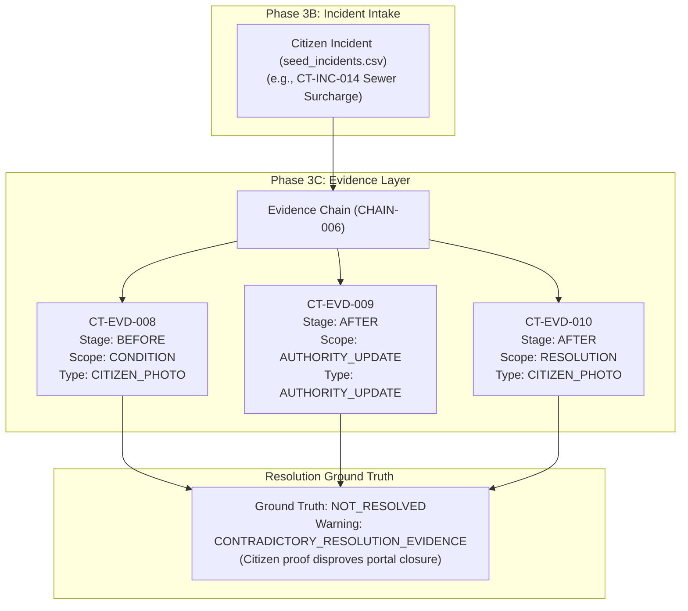
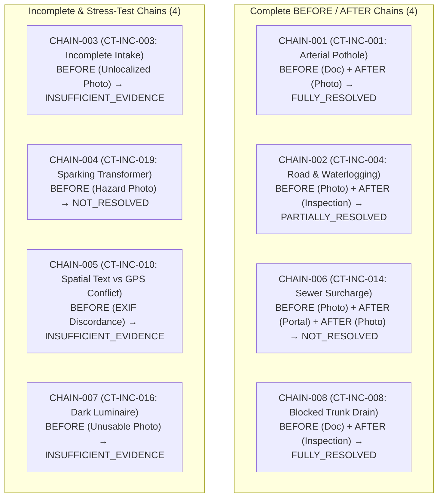

# CivicTrace Phase 3C: Lucknow Evidence Dataset Technical Report

**Document ID:** `DOC-CT-PHASE3C-001`  
**Phase:** 3C — Evidence Layer & Resolution Ground Truth  
**Baseline Date:** September 2026  
**Status:** COMPLETE & FROZEN  
**Dependencies:** Phase 1 (`data/authority/`), Phase 2 (`data/gis/`), Phase 3A (`data/lucknow/assets/`), Phase 3B (`data/lucknow/incidents/`)  

---

## 1. Executive Summary & Objective

Phase 3C establishes a high-quality, provenance-aware **Evidence Dataset** (`data/lucknow/evidence/evidence.csv`) and automated validation suite (`scripts/validate_evidence.py`) for the CivicTrace platform. It directly extends the foundational incident corpus created in Phase 3B by anchoring civic grievances to empirical observations, field logs, photographic artifacts, and administrative notices.

The evidence layer answers two critical operational questions:
1. **"What evidence exists for this incident?"**
2. **"Does the available evidence support that the issue was resolved?"**

### Scope Boundaries
Phase 3C is strictly a **DATA COLLECTION AND DATA VALIDATION** phase. It adheres strictly to the project-wide boundaries:
- **No Machine Learning / AI / LLMs**: No predictive models, prompt chains, or automated triage.
- **No Computer Vision / NLP**: No image similarity, optical character recognition, or natural language duplicate detection (deferred to Phase 3D).
- **No Automated Ticket Dispatch or UI**: No automated dispatch, dashboards, or external API endpoints.

### Key Metrics Summary
- **Total Evidence Records:** 13 (`CT-EVD-001` through `CT-EVD-013`)
- **Total Incidents Represented:** 8 (`CT-INC-001`, `CT-INC-003`, `CT-INC-004`, `CT-INC-008`, `CT-INC-010`, `CT-INC-014`, `CT-INC-016`, `CT-INC-019`)
- **Evidence Chains:** 8 (`CHAIN-001` through `CHAIN-008`)
- **Complete BEFORE/AFTER Chains:** 4 chains
- **Incomplete Chains:** 4 chains
- **Contradictory Chains Flagged:** 1 chain (`CHAIN-006` / `CT-INC-014`)
- **Unsupported FULLY_RESOLVED Claims:** 0 (Hard constraint satisfied)
- **Record Types:** 2 `REAL_DOCUMENTED`, 11 `SYNTHETIC_EVALUATION`
- **Integrity Status:** PASSED (0 Errors, 0 Unintended Warnings, 7 Intentional Test Warnings)
- **Regression Status:** PASSED across all 5 validation suites with zero modifications to prior datasets.

---

## 2. The Complete Relational Chain

Phase 3C completes the empirical verification leg of the CivicTrace relational graph:

$$\textbf{INCIDENT} \longrightarrow \textbf{CHAIN} \longrightarrow \textbf{EVIDENCE} \longrightarrow \textbf{STAGE} \longrightarrow \textbf{SCOPE} \longrightarrow \textbf{RESOLUTION GROUND TRUTH}$$



### Relational Decoupling Principles

1. **Curated Ground Truth vs. Individual Record Claims**:
   The `resolution_label` field is an incident-level ground truth curation. An individual evidence record belonging to the `AFTER` stage does not unilaterally imply that the issue was resolved.
2. **Authority Update Decoupling & Contradiction Preservation**:
   An administrative portal update asserting that a complaint is "closed" does not automatically validate resolution. Where subsequent empirical proof (such as a citizen follow-up photograph) proves that the defect persists, the contradiction is preserved as an intentional warning (`CONTRADICTORY_RESOLUTION_EVIDENCE`) and the ground truth remains `NOT_RESOLVED`.
3. **Decoupled Evidence Scope**:
   Every evidence record carries an explicit `evidence_scope` (`INCIDENT`, `LOCATION`, `CONDITION`, `RESOLUTION`, or `AUTHORITY_UPDATE`). A document substantiating pre-existing `CONDITION` does not constitute proof of `RESOLUTION`.
4. **Decoupled Spatial Context**:
   Evidence records possess their own `latitude`, `longitude`, and `location_status`. Where coordinates cannot be established, `UNKNOWN` is assigned with null coordinates. For non-spatial portal updates, `NOT_APPLICABLE` is applied. Spatial discordance between intake narratives and photographic EXIF metadata is recorded as `CONFLICT` without mutating coordinates.

---

## 3. Final 18-Column Schema Specification

The dataset `data/lucknow/evidence/evidence.csv` strictly implements the 18 columns below:

| # | Column Name | Type | Allowed Values / Format | Description |
| :-: | :--- | :--- | :--- | :--- |
| 1 | `evidence_id` | String | `CT-EVD-xxx` | Unique identifier for the individual evidence item. |
| 2 | `evidence_chain_id` | String | `CHAIN-xxx` | Sequence identifier linking evidence items for an incident. |
| 3 | `incident_id` | String | `CT-INC-xxx` | Foreign key referencing `seed_incidents.csv`. |
| 4 | `evidence_type` | Enum | `CITIZEN_PHOTO`, `CITIZEN_VIDEO`, `AUTHORITY_UPDATE`, `BEFORE_PHOTO`, `AFTER_PHOTO`, `FIELD_INSPECTION`, `DOCUMENTARY_EVIDENCE` | Media or documentary form of the empirical observation. |
| 5 | `evidence_stage` | Enum | `BEFORE`, `DURING`, `AFTER`, `UNKNOWN` | Temporal point in the defect lifecycle. |
| 6 | `evidence_scope` | Enum | `INCIDENT`, `LOCATION`, `CONDITION`, `RESOLUTION`, `AUTHORITY_UPDATE` | What the evidence item specifically substantiates. |
| 7 | `file_path` | URI | Virtual URI, `source://...`, or empty | Path or URI reference. Empty for undocumented files. |
| 8 | `latitude` | Float | Decimal WGS84, or empty | Latitude coordinate of observation point. |
| 9 | `longitude` | Float | Decimal WGS84, or empty | Longitude coordinate of observation point. |
| 10 | `capture_time` | Timestamp | ISO 8601 UTC (`YYYY-MM-DDTHH:MM:SSZ`) | Moment of empirical observation capture. |
| 11 | `source_type` | Enum | `REAL_DOCUMENTED`, `OWN_CONTROLLED`, `SYNTHETIC_EVALUATION` | Provenance classification of the record. |
| 12 | `resolution_label` | Enum | `FULLY_RESOLVED`, `PARTIALLY_RESOLVED`, `NOT_RESOLVED`, `INSUFFICIENT_EVIDENCE` | Curated resolution ground truth across the chain. |
| 13 | `evidence_quality` | Enum | `HIGH`, `MEDIUM`, `LOW`, `UNUSABLE` | Technical quality of the observation or media. |
| 14 | `confidence` | Float | Decimal range `0.0` to `1.0` | Human/curator confidence in evidentiary validity. |
| 15 | `source_id` | String | `SRC-xxx` | Registered source ID from Phase 1/Phase 2 registry. |
| 16 | `source_reference` | String | Text citation or synthetic scenario basis | Specific chapter, schedule, or evaluation scenario. |
| 17 | `location_status` | Enum | `VERIFIED`, `APPROXIMATE`, `UNKNOWN`, `CONFLICT`, `NOT_APPLICABLE` | Spatial grounding certainty. |
| 18 | `notes` | String | Text | Contextual notes, methodological explanations. |

---

## 4. End-to-End Walkthrough of Evidence Chains

The 13 evidence records are partitioned across 8 distinct evidence chains exercising diverse real-world civic situations:



### Chain 1: `CHAIN-001` (`CT-INC-001`) — Arterial Pothole Repair
- **Incident:** `CT-INC-001` (Real documented arterial road distress on MG Marg near GPO, maintained by UP PWD).
- **Records:**
  - `CT-EVD-001`: `BEFORE` | `DOCUMENTARY_EVIDENCE` | `CONDITION` | `REAL_DOCUMENTED` | Quality: `HIGH` | Confidence: `0.95`. Sourced from UP PWD Lucknow Circle Road Condition Schedule Section 4 (`SRC-007`). `file_path` is empty to avoid file fabrication.
  - `CT-EVD-002`: `AFTER` | `AFTER_PHOTO` | `RESOLUTION` | `SYNTHETIC_EVALUATION` | Quality: `HIGH` | Confidence: `0.90`. Cites `synthetic://CT-INC-001/after-patch-repair`. Demonstrates full bituminous overlay.
- **Ground Truth:** `FULLY_RESOLVED`. Supported by complete repair verification.

### Chain 2: `CHAIN-002` (`CT-INC-004`) — Partial Road Repair
- **Incident:** `CT-INC-004` (Colony road damage with secondary waterlogging, Zone 3).
- **Records:**
  - `CT-EVD-003`: `BEFORE` | `CITIZEN_PHOTO` | `INCIDENT` | `SYNTHETIC_EVALUATION` | Quality: `MEDIUM` | Confidence: `0.85`. Shows potholes filled with stagnant rainwater.
  - `CT-EVD-004`: `AFTER` | `FIELD_INSPECTION` | `RESOLUTION` | `SYNTHETIC_EVALUATION` | Quality: `HIGH` | Confidence: `0.90`. Junior Engineer inspection report confirms stone grit backfilling completed over depression, but roadside drainage berm was left uncleared, causing waterlogging to persist.
- **Ground Truth:** `PARTIALLY_RESOLVED`. Core road defect was temporarily filled, but drainage defect remains unresolved.

### Chain 3: `CHAIN-003` (`CT-INC-003`) — Missing Intake Location
- **Incident:** `CT-INC-003` (Difficult Case C: Pothole complaint with missing locality and no GPS).
- **Records:**
  - `CT-EVD-005`: `BEFORE` | `CITIZEN_PHOTO` | `CONDITION` | `SYNTHETIC_EVALUATION` | Quality: `LOW` | Confidence: `0.40`. Close-up photo of asphalt hole with stripped EXIF and blurred background. Coordinates are null; `location_status = UNKNOWN`.
- **Ground Truth:** `INSUFFICIENT_EVIDENCE`. Inability to localize prevents asset linkage or dispatch.

### Chain 4: `CHAIN-004` (`CT-INC-019`) — Active Electrical Hazard
- **Incident:** `CT-INC-019` (Difficult Case B: Pole-mounted transformer sparking in Sector Q).
- **Records:**
  - `CT-EVD-006`: `BEFORE` | `CITIZEN_PHOTO` | `INCIDENT` | `SYNTHETIC_EVALUATION` | Quality: `HIGH` | Confidence: `0.90`. Captures severe arcing and smoke at distribution transformer bushings. No subsequent repair or disconnector maintenance record exists.
- **Ground Truth:** `NOT_RESOLVED`. Critical public safety defect without resolution evidence.

### Chain 5: `CHAIN-005` (`CT-INC-010`) — Context-Supported Spatial Conflict
- **Incident:** `CT-INC-010` (Difficult Case D: Spatial text vs coordinate conflict).
- **Records:**
  - `CT-EVD-007`: `BEFORE` | `CITIZEN_PHOTO` | `LOCATION` | `SYNTHETIC_EVALUATION` | Quality: `MEDIUM` | Confidence: `0.50`. Smartphone photo where embedded EXIF coordinates place the camera in Hazratganj (`26.85025, 80.94380`), while the complaint text explicitly cites Kapoorthala Aliganj (~1.4 km distant).
- **Spatial Handling:** Coordinates are preserved exactly without mutation; `location_status = CONFLICT`.
- **Ground Truth:** `INSUFFICIENT_EVIDENCE`.

### Chain 6: `CHAIN-006` (`CT-INC-014`) — Contradictory Resolution Evidence
- **Incident:** `CT-INC-014` (Commercial lane sewer surcharging through manhole in Hazratganj).
- **Records:**
  - `CT-EVD-008`: `BEFORE` | `CITIZEN_PHOTO` | `CONDITION` | `SYNTHETIC_EVALUATION` | Initial citizen photo of raw wastewater overflowing onto lane.
  - `CT-EVD-009`: `AFTER` | `AUTHORITY_UPDATE` | `AUTHORITY_UPDATE` | `SYNTHETIC_EVALUATION` | Quality: `MEDIUM`. Portal text entry: *"Suction jetting vehicle deployed, blockage cleared, grievance marked resolved."* No photo or engineer sign-off. `location_status = NOT_APPLICABLE`; coordinates null.
  - `CT-EVD-010`: `AFTER` | `CITIZEN_PHOTO` | `RESOLUTION` | `SYNTHETIC_EVALUATION` | Quality: `HIGH` | Confidence: `0.95`. Citizen follow-up rejoinder photo taken 2 hours after closure showing wastewater continuing to boil up from the manhole.
- **Ground Truth:** `NOT_RESOLVED`. The validator detects the clash between authority closure and citizen empirical proof, emitting an intentional warning (`CONTRADICTORY_RESOLUTION_EVIDENCE`).

### Chain 7: `CHAIN-007` (`CT-INC-016`) — Poor-Quality / Unusable Media
- **Incident:** `CT-INC-016` (Streetlight failure on municipal pole in Indira Nagar Sector 14).
- **Records:**
  - `CT-EVD-011`: `BEFORE` | `CITIZEN_PHOTO` | `CONDITION` | `SYNTHETIC_EVALUATION` | Quality: `UNUSABLE` | Confidence: `0.20`. Nighttime smartphone capture ruined by severe motion blur and pitch-black underexposure. Luminaire and pole tag cannot be distinguished.
- **Ground Truth:** `INSUFFICIENT_EVIDENCE`.

### Chain 8: `CHAIN-008` (`CT-INC-008`) — Real Documented Trunk Drain Desilting
- **Incident:** `CT-INC-008` (Heavy siltation in covered trunk drain along Trilokinath Road culvert, LMC Civil Division).
- **Records:**
  - `CT-EVD-012`: `BEFORE` | `DOCUMENTARY_EVIDENCE` | `CONDITION` | `REAL_DOCUMENTED` | Quality: `HIGH` | Confidence: `0.95`. Cites LMC Civil Engineering pre-monsoon survey (`SRC-005`, Ch 10) recording >60% hydraulic cross-section obstruction. `file_path` empty.
  - `CT-EVD-013`: `AFTER` | `FIELD_INSPECTION` | `RESOLUTION` | `SYNTHETIC_EVALUATION` | Quality: `HIGH` | Confidence: `0.90`. Assistant Engineer post-desiltation field measurement log confirming barrel desilting to invert level and free gravity flow.
- **Ground Truth:** `FULLY_RESOLVED`. Supported by engineering field verification.

---

## 5. Provenance Standards & Zero Fabrication Policy

CivicTrace maintains a strict zero-fabrication standard:
1. **Never Invent Physical Files:** No fake image files or forged government PDFs are generated on disk.
2. **Transparent URI Standards:**
   - Real documented evidence leaves `file_path` empty (or cites internal reference `source://<source_id>/<section>`).
   - Synthetic evaluation scenarios explicitly use `synthetic://<incident_id>/<scenario>`.
3. **Traceability to Statutory Registries:**
   All records cite verified source identifiers (`SRC-001` through `SRC-019`) registered during Phase 1 (`data/sources/source_registry.csv`) and Phase 2 (`data/gis/gis_source_registry.csv`).
4. **Transparent Evaluation Grounding:**
   Synthetic records explicitly describe the evaluation scenario in `source_reference`.

---

## 6. Validation Suite Architecture (`scripts/validate_evidence.py`)

The automated validation suite executes a comprehensive multi-stage audit:

1. **Schema Audit:** Validates exact 18-column header sequence and non-empty constraints.
2. **Foreign Key Integrity:** Verifies that every `incident_id` matches an existing record in `seed_incidents.csv`.
3. **Controlled Vocabularies:** Enforces exact memberships across 7 enums.
4. **Human Confidence Rating:** Asserts that `confidence` is a decimal float in range $[0.0, 1.0]$.
5. **Spatial Bounds & Decoupling:**
   - Evaluates coordinates against the broad Lucknow envelope ($26.60^\circ$–$27.15^\circ\text{N}$, $80.70^\circ$–$81.25^\circ\text{E}$).
   - Permits empty coordinates when `location_status` is `UNKNOWN` or `NOT_APPLICABLE`.
   - Logs `CONFLICT` cases without mutating spatial coordinates.
6. **Chain & Pairing Verification:**
   - Audits `evidence_chain_id` grouping.
   - Enforces that `FULLY_RESOLVED` ground truth must have supporting `AFTER` stage, `FIELD_INSPECTION`, or `RESOLUTION` scope evidence (`unsupported_full_resolution_claims = 0`).
   - Flags `CONTRADICTORY_RESOLUTION_EVIDENCE` where authority closure is disproven by citizen proof.
7. **Duplicate Detection:**
   - Hard error on duplicate `evidence_id`.
   - Permits multiple legitimate evidence records for the same incident and chain.
   - Strictly excludes ML/CV image similarity and NLP clustering logic.

---

## 7. Validation & Full System Regression Results

### Phase 3C Evidence Validation Output
```
===========================================================================
CIVICTRACE PHASE 3C: EVIDENCE DATASET VALIDATION SUITE
===========================================================================
[CHECK 1] Deliverable & Dependency File Existence: PASS (All present)
[CHECK 2] Phase 3B Seed Incidents Ingestion: PASS (20 seed incidents loaded)
[CHECK 3] Provenance Source Registries Ingestion: PASS (19 registered sources loaded)
[CHECK 4] Evidence CSV Schema & Header Conformance: PASS (Exactly 18 columns)
[AUDITING 13 EVIDENCE RECORDS UNDER PHASE 3C INTEGRITY RULES]
  [INTENTIONAL TEST WARNING] Evidence CT-EVD-007 (Incident CT-INC-010): Spatial conflict test.
  [INTENTIONAL TEST WARNING] Evidence CT-EVD-011 (Incident CT-INC-016): Unusable image test.
[CHECK 5] Evidence Chain & Resolution Ground-Truth Consistency Audit:
  [INTENTIONAL TEST WARNING] Chain CHAIN-003: Incomplete chain (BEFORE only).
  [INTENTIONAL TEST WARNING] Chain CHAIN-004: Incomplete chain (BEFORE only).
  [INTENTIONAL TEST WARNING] Chain CHAIN-005: Incomplete chain (BEFORE only).
  [INTENTIONAL TEST WARNING] Chain CHAIN-006: CONTRADICTORY_RESOLUTION_EVIDENCE detected.
  [INTENTIONAL TEST WARNING] Chain CHAIN-007: Incomplete chain (BEFORE only).

===========================================================================
Total Evidence Records Evaluated: 13
Total Incidents Represented:     8
Total Evidence Chains:           8
Complete BEFORE/AFTER Chains:    4
Incomplete Evidence Chains:      4
Contradictory Chains Flagged:    1
Unsupported FULLY_RESOLVED:      0
Validation Status:               PASSED (0 Errors)
Intentional Test Warnings:       7
===========================================================================
```

### Full System Regression Audit Across All Phases

| Phase | Validation Suite | Test Scope | Status | Prior Files Modified? |
| :--- | :--- | :--- | :---: | :---: |
| **Phase 1** | `validate_lexicon.py` | 39 Lexicon Records, Master JSON, Conflicts | **PASS** (0 Errors) | None (Frozen) |
| **Phase 2** | `validate_gis.py` | 110 Wards, 8 Zones, GIS Sources, Geometries | **PASS** (0 Errors) | None (Frozen) |
| **Phase 3A** | `validate_assets.py` | 39 Physical Assets, Spatial Linkages | **PASS** (0 Errors) | None (Frozen) |
| **Phase 3B** | `validate_incidents.py` | 20 Seed Incidents, 5 Difficult Cases | **PASS** (0 Errors) | None (Frozen) |
| **Phase 3C** | `validate_evidence.py` | 13 Evidence Records, 8 Chains, Enums, Truth | **PASS** (0 Errors) | N/A (New Phase) |

**Git Verification:**
```bash
git diff --stat
# Result: 0 modifications to data/authority/, data/gis/, data/lucknow/assets/, or data/lucknow/incidents/seed_incidents.csv
```

---

## 8. Final Acceptance Checklist

- [x] `data/lucknow/evidence/evidence.csv` exists and contains 13 records across 18 columns.
- [x] `data/lucknow/evidence/README.md` exists with complete technical explanations.
- [x] `scripts/validate_evidence.py` exists and enforces all constraints.
- [x] `data/lucknow/evidence/evidence_validation_report.json` exists with required metrics.
- [x] `docs/phase3c_evidence.md` exists as the comprehensive technical report.
- [x] Exactly 8 incidents from Phase 3B are represented across 8 evidence chains.
- [x] No fake government files or inspection documents were fabricated.
- [x] Synthetic records use transparent `synthetic://` URI schemes.
- [x] Real documented records cite statutory sources with empty file paths.
- [x] Decoupled resolution labels and evidence scopes prevent false resolution inferences.
- [x] Spatial uncertainty (`CONFLICT`, `UNKNOWN`, `NOT_APPLICABLE`) is explicitly handled.
- [x] Phase 1, Phase 2, Phase 3A, and Phase 3B datasets remain 100% frozen and unmodified.
- [x] All 5 validation suites execute cleanly with zero errors.
- [x] No AI, ML, NLP, or CV logic was introduced.
