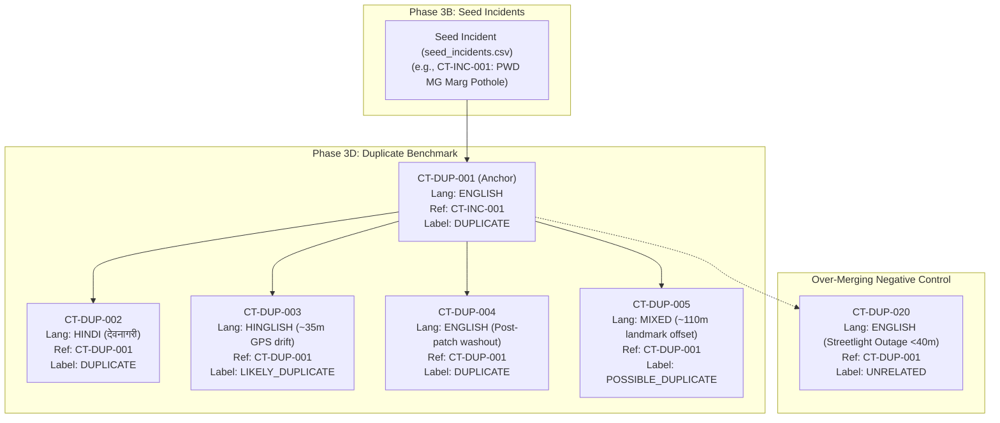
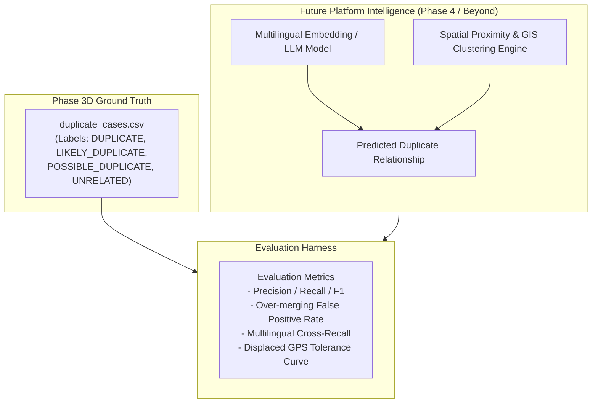

# CivicTrace Phase 3D: Synthetic Duplicate & Intelligence Evaluation Dataset Technical Report

**Document ID:** `DOC-CT-PHASE3D-001`  
**Phase:** 3D — Synthetic Duplicate & Intelligence Evaluation Dataset  
**Baseline Date:** September 2026  
**Status:** COMPLETE & FROZEN  
**Dependencies:** Phase 1 (`data/authority/`), Phase 2 (`data/gis/`), Phase 3A (`data/lucknow/assets/`), Phase 3B (`data/lucknow/incidents/`), Phase 3C (`data/lucknow/evidence/`)  

---

## 1. Executive Summary & Objective

Phase 3D delivers a high-quality, Lucknow-specific, multilingual **Synthetic Duplicate & Intelligence Evaluation Dataset** (`data/lucknow/duplicates/duplicate_cases.csv`), automated validation suite (`scripts/validate_duplicates.py`), and machine-readable audit report (`data/lucknow/duplicates/duplicate_validation_report.json`) for the CivicTrace platform.

### Purpose of Phase 3D
The primary purpose is to establish a rigorous, human-curated **ground-truth benchmark** for evaluating future duplicate detection algorithms, cross-lingual matching models, spatial proximity heuristics, and triage intelligence components.

> [!IMPORTANT]
> **SYNTHETIC BENCHMARK STATUS (NO REAL COMPLAINT DATA)**:
> This dataset is synthetic evaluation data for the CivicTrace hackathon MVP and must not be interpreted as a real citizen complaint database, official municipal records, or production telemetry.
>
> All 26 records are explicitly tagged:
> ```
> data_mode   = SYNTHETIC_EVALUATION
> source_type = SYNTHETIC_EVALUATION
> ```
> No real citizen names, phone numbers, fabricated government complaint IDs, or false official SLA statements have been created.

### Hackathon Positioning
> *"CivicTrace's hackathon MVP uses synthetic evaluation data to demonstrate the end-to-end intelligence workflow. The data model is designed so that synthetic records can later be replaced by real citizen reports, GIS data, authority records, and evidence after deployment and appropriate privacy/provenance controls."*

Controlled synthetic data provides a reproducible and balanced testing ground, allowing deliberate stress-testing of edge cases, cross-lingual expressions (English, Devanagari Hindi, Romanized Hinglish, Mixed), varying GPS accuracy, repeated complaints, and negative controls.

### Scope Guardrails (Zero AI Implementation)
Phase 3D is strictly a **DATA BENCHMARK PREPARATION** phase. It adheres strictly to project boundaries:
- **No Machine Learning / LLMs / Prompt Engineering**: No automated duplicate clustering or LLM classification.
- **No Vector Databases or Embeddings**: No embedding generation, vector indexing, or cosine similarity search.
- **No NLP Similarity Scoring**: No automated Levenshtein, Jaro-Winkler, or TF-IDF matching scripts.
- **No Automatic Merging or Ticket Dispatch**: No mutation of ticket databases or dispatch pipelines.

---

## 2. Key Metrics Summary

```
Total Synthetic Duplicate Records : 26 records
Total Candidate Clusters          : 7 clusters
Validation Status                 : PASSED (0 Errors, 0 Warnings)
Prior Phase Immutability          : VERIFIED (Phases 1, 2, 3A, 3B, 3C intact)
```

### Label Distribution (Ground Truth)
| Duplicate Label | Count | Percentage | Target Guidance | Compliance |
| :--- | :---: | :---: | :---: | :---: |
| `DUPLICATE` | 9 | 34.6% | 8–10 | Optimal |
| `LIKELY_DUPLICATE` | 5 | 19.2% | 4–6 | Optimal |
| `POSSIBLE_DUPLICATE` | 5 | 19.2% | 4–6 | Optimal |
| `UNRELATED` | 7 | 26.9% | 6–10 | Optimal |
| **Total** | **26** | **100.0%** | **20–30** | **Exact** |

### Language Coverage
| Language | Script / Modality | Record Count | Representation |
| :--- | :--- | :---: | :--- |
| `ENGLISH` | Latin script | 14 | Standard municipal intake English |
| `HINDI` | Devanagari script (`देवनागरी`) | 5 | Authentic vernacular phrasing |
| `HINGLISH` | Romanized Hindi | 5 | Colloquial smartphone reporting |
| `MIXED` | English technical + Hindi syntax | 2 | Domain-hybrid citizen phrasing |

### Issue Category Distribution (Phase 3B Compatible)
| Issue Category | Records | Domain / Infrastructure Scope |
| :--- | :---: | :--- |
| `POTHOLE` | 5 | Arterial & municipal roadway surface distress |
| `BLOCKED_DRAIN` | 5 | Stormwater trunk & peripheral drainage siltation |
| `STREETLIGHT_FAILURE` | 4 | Municipal LED luminaire & high-mast outages |
| `WATERLOGGING` | 3 | Commercial intersection storm runoff accumulation |
| `BROKEN_PIPELINE` | 3 | High-pressure potable clear-water trunk ruptures |
| `GARBAGE_ACCUMULATION` | 1 | Unattended municipal roadside waste mounds |
| `ILLEGAL_DUMPING` | 1 | Unauthorized open plot dumping (negative control) |
| `WATER_LEAKAGE` | 1 | Sub-surface residential reticulation leak (negative control) |
| `SEWER_OVERFLOW` | 1 | Commercial lane surcharging sewer manhole (negative control) |
| `ELECTRICAL_INFRASTRUCTURE` | 1 | MVVNL leaning distribution utility pole (negative control) |
| `ROAD_DAMAGE` | 1 | LDA sector road subsidence (negative control) |

---

## 3. Relational Architecture & Cluster Design

Phase 3D connects directly into the CivicTrace relational graph:



### Relational Decoupling Rules
1. **`incident_id`**: Identifies underlying physical incident linkage in `seed_incidents.csv`. Where a synthetic duplicate scenario intentionally corresponds to an existing Phase 3B incident, it references `CT-INC-xxx`. Where no existing incident is appropriate (e.g. cross-domain negative controls), `UNKNOWN` is assigned. Phase 3B is never modified.
2. **`reference_record_id`**: Identifies the anchor record against which the pairwise duplicate relationship is evaluated. This may be another `CT-DUP-xxx` record within the cluster or a seed `CT-INC-xxx` record.
3. **`cluster_id`**: Represents a **human-curated ground-truth grouping** of complaints relating to an underlying civic issue or candidate evaluation cluster. It is not an algorithmic cluster.
4. **`curation_confidence`**: Represents human data curator confidence in the assigned relationship. It is not an AI probability.

---

## 4. End-to-End Walkthrough of Candidate Clusters

### Cluster 1: `CLUSTER-001` — Mahatma Gandhi Marg Arterial Pothole (Hazratganj)
- **Underlying Incident:** `CT-INC-001` (Major arterial road distress, MG Marg near GPO, UP PWD).
- **Physical Asset:** `AST-ROAD-001` (Mahatma Gandhi Marg PWD corridor).
- **Jurisdiction:** Ward 34 (Hazratganj / Raj Bhavan), Zone 1 | Authority: `AUTH-UPPWD`.
- **Records Evaluated:**
  - `CT-DUP-001` (`ENGLISH` | `DUPLICATE` | Ref: `CT-INC-001`): Baseline English grievance reporting deep crater near GPO. Anchor.
  - `CT-DUP-002` (`HINDI` | `DUPLICATE` | Ref: `CT-DUP-001`): Authentic Devanagari translation describing identical crater ("हजरतगंज में जीपीओ के सामने मुख्य सड़क पर बहुत गहरा गड्ढा...").
  - `CT-DUP-003` (`HINGLISH` | `LIKELY_DUPLICATE` | Ref: `CT-DUP-001`): Colloquial phrasing with ~35m GPS drift along the road corridor.
  - `CT-DUP-004` (`ENGLISH` | `DUPLICATE` | Ref: `CT-DUP-001`): Repeat complaint reporting that loose gravel backfilled during temporary repair washed out during rain.
  - `CT-DUP-005` (`MIXED` | `POSSIBLE_DUPLICATE` | Ref: `CT-DUP-001`): Landmark-based reference citing "Hazratganj crossing toward GPO" with ~110m spatial offset.

### Cluster 2: `CLUSTER-002` — Kaiserbagh / Trilokinath Road Trunk Drain Blockage
- **Underlying Incident:** `CT-INC-008` (Covered trunk drain siltation, Trilokinath Rd culvert, LMC Civil).
- **Physical Asset:** `AST-DRN-001` (Kaiserbagh Stormwater Trunk Drain).
- **Jurisdiction:** Ward 34, Zone 1 | Authority: `AUTH-LMC`.
- **Records Evaluated:**
  - `CT-DUP-006` (`ENGLISH` | `DUPLICATE` | Ref: `CT-INC-008`): Baseline English grievance reporting choked trunk drain culvert. Anchor.
  - `CT-DUP-007` (`HINDI` | `DUPLICATE` | Ref: `CT-DUP-006`): Devanagari complaint reporting identical covered nala blockage ("त्रिलोकीनाथ मार्ग पर बड़ा ढका हुआ नाला...").
  - `CT-DUP-008` (`HINGLISH` | `POSSIBLE_DUPLICATE` | Ref: `CT-DUP-006`): Authentic Hinglish report with completely missing GPS coordinates (`location_status = UNKNOWN`).
  - `CT-DUP-009` (`ENGLISH` | `LIKELY_DUPLICATE` | Ref: `CT-DUP-006`): Downstream street chamber backup ~45m along the same continuous covered drainage alignment.

### Cluster 3: `CLUSTER-003` — Chowk Chauraha High-Mast Lighting Outage
- **Underlying Incident:** `CT-INC-017` (High-mast lighting failure at Chowk Chauraha roundabout, LMC E&M).
- **Physical Asset:** `AST-STL-005` (Chowk Chauraha High-Mast Luminaire).
- **Jurisdiction:** Ward 106 (Chowk), Zone 6 | Authority: `AUTH-LMC`.
- **Records Evaluated:**
  - `CT-DUP-010` (`ENGLISH` | `DUPLICATE` | Ref: `CT-INC-017`): High-mast tower completely unlit for 3 nights. Anchor.
  - `CT-DUP-011` (`HINDI` | `DUPLICATE` | Ref: `CT-DUP-010`): Devanagari report describing dark Chowk roundabout ("चौक चौराहे की हाई-मास्ट लाइट की सभी बत्तियां...").
  - `CT-DUP-012` (`ENGLISH` | `POSSIBLE_DUPLICATE` | Ref: `CT-DUP-010`): Streetlight bracket failure on Victoria Street ~140m away. Evaluates distinct physical fixture on the same feeder.

### Cluster 4: `CLUSTER-004` — Kapoorthala Commercial Intersection Waterlogging (Aliganj)
- **Underlying Incident:** `CT-INC-010` (Commercial intersection waterlogging, Kapoorthala, LMC Civil).
- **Physical Asset:** `AST-DRN-003` (Kapoorthala Roadside Stormwater Drain).
- **Jurisdiction:** Ward 109 (Aliganj), Zone 3 | Authority: `AUTH-LMC`.
- **Records Evaluated:**
  - `CT-DUP-013` (`HINGLISH` | `DUPLICATE` | Ref: `CT-INC-010`): Hinglish complaint with correct Kapoorthala coordinates resolving the Phase 3B spatial conflict test case. Anchor.
  - `CT-DUP-014` (`ENGLISH` | `LIKELY_DUPLICATE` | Ref: `CT-DUP-013`): Cross-corner intersection complaint displaced ~60m diagonally across the crossing.
  - `CT-DUP-015` (`ENGLISH` | `POSSIBLE_DUPLICATE` | Ref: `CT-DUP-013`): Vague grievance ("waterlogged street near market in Aliganj") lacking landmark specificity.

### Cluster 5: `CLUSTER-005` — Aishbagh Ruptured Potable Water Trunk Main
- **Underlying Incident:** `CT-INC-012` (Burst potable water trunk main, Aishbagh Water Works, Lucknow Jal Sansthan).
- **Physical Asset:** `AST-WTR-001` (Aishbagh Potable Feeder Trunk Main).
- **Jurisdiction:** Ward 26 (Aishbagh), Zone 2 | Authority: `AUTH-LKO-JALSANSTHAN`.
- **Records Evaluated:**
  - `CT-DUP-016` (`HINDI` | `DUPLICATE` | Ref: `CT-INC-012`): Devanagari grievance reporting thousands of liters of clean water bursting onto street. Anchor.
  - `CT-DUP-017` (`ENGLISH` | `LIKELY_DUPLICATE` | Ref: `CT-DUP-016`): English complaint displaced ~75m east along the Mill Road transmission corridor.
  - `CT-DUP-018` (`MIXED` | `LIKELY_DUPLICATE` | Ref: `CT-DUP-016`): Mixed repeat complaint after 2 days of persistent leakage along the pipeline alignment.

### Cluster 6: `CLUSTER-006` — Guru Nanak Nagar Solid Waste Berm (Alambagh)
- **Underlying Incident:** `CT-INC-005` (Unattended municipal roadside waste mound, Alambagh, LMC SWM).
- **Physical Asset:** `UNKNOWN` (Diffuse solid waste - legitimate unlinked physical asset).
- **Jurisdiction:** Ward 23 (Guru Nanak Nagar), Zone 5 | Authority: `AUTH-LMC`.
- **Records Evaluated:**
  - `CT-DUP-019` (`HINGLISH` | `POSSIBLE_DUPLICATE` | Ref: `CT-INC-005`): Open waste accumulation ~120m away at the corner of residential Lane No. 3. Tests whether secondary waste piles are grouped or treated as separate collection points.

### Cluster 7: `CLUSTER-007` — Cross-Domain Unrelated Negative Controls
Negative controls specifically engineered to test and prevent **over-merging** in future intelligence systems:
- `CT-DUP-020` (`ENGLISH` | `UNRELATED` | Ref: `CT-DUP-001`): Streetlight out on MG Marg divider (<40m from GPO pothole). Same locality, completely different issue domain and authority (`AUTH-LMC` vs `AUTH-UPPWD`).
- `CT-DUP-021` (`ENGLISH` | `UNRELATED` | Ref: `CT-DUP-006`): Choked stormwater drain in Gomti Nagar Vibhuti Khand. Matches Kaiserbagh drain text ("stormwater drain choked and overflowing"), but located 4.2 km away on a different outfall canal (`AST-DRN-004`).
- `CT-DUP-022` (`HINGLISH` | `UNRELATED` | Ref: `CT-DUP-013`): Sub-surface drinking water line leak in Aliganj Sector C. Shares terms "Aliganj", "sadak", "paani", but is potable water maintenance under Jal Sansthan (`AST-WTR-003`) rather than storm runoff under LMC Civil (`AST-DRN-003`).
- `CT-DUP-023` (`ENGLISH` | `UNRELATED` | Ref: `CT-DUP-010`): Leaning MVVNL electric pole with live wires in Chowk. Both in Chowk Ward 106, but distinct utility infrastructure (`AST-ELE-005`) under LESA vs municipal luminaire (`AST-STL-005`) under LMC.
- `CT-DUP-024` (`HINDI` | `UNRELATED` | Ref: `CT-DUP-019`): Illegal waste dumping on vacant plot in Chowk. Shares garbage vocabulary, but separated by ~9 km in Zone 6 vs Alambagh Zone 5.
- `CT-DUP-025` (`ENGLISH` | `UNRELATED` | Ref: `CT-DUP-016`): Surcharging sewer manhole in Hazratganj lane. Shares pipe/overflow terms with Aishbagh potable main rupture, but involves distinct sub-department and location.
- `CT-DUP-026` (`ENGLISH` | `UNRELATED` | Ref: `CT-DUP-001`): Road subsidence on LDA sector road in Gomti Nagar Vipin Khand. Shares asphalt damage terms, but in an un-transferred LDA layout (~3.5 km away) under `AUTH-LDA` vs PWD arterial corridor.

---

## 5. Coverage of 10 Difficult Evaluation Scenarios

| # | Difficult Evaluation Scenario | Implementation Record | Benchmark Challenge Addressed |
| :-: | :--- | :--- | :--- |
| 1 | **Same issue, approximate location** | `CT-DUP-003` | Tests spatial distance threshold (~35m GPS drift along roadway). |
| 2 | **Same issue, different language** | `CT-DUP-002`, `CT-DUP-007`, `CT-DUP-011`, `CT-DUP-016` | Tests cross-lingual semantic matching (Devanagari vs English). |
| 3 | **Same issue, different wording** | `CT-DUP-001` | Tests vocabulary independence ("crater-like pothole" vs "bituminous disintegration"). |
| 4 | **Same locality, different issue** | `CT-DUP-020`, `CT-DUP-023` | Negative control: Prevents spatial clustering from merging potholes with streetlights (<40m apart). |
| 5 | **Same wording, different locality** | `CT-DUP-021` | Negative control: Prevents text-similarity engines from merging identical complaints across distant wards (4.2 km apart). |
| 6 | **Same issue reported after partial repair** | `CT-DUP-004` | Tests repeat complaint detection when an issue recurs post-monsoon washout. |
| 7 | **Duplicate candidate with insufficient evidence** | `CT-DUP-015` | Tests handling of low-specificity complaints ("waterlogged street near market"). Must yield `POSSIBLE_DUPLICATE`. |
| 8 | **Two complaints appear duplicate but are separate** | `CT-DUP-012`, `CT-DUP-019` | Tests physical asset boundary resolution: adjacent streetlights (140m apart) or adjacent garbage mounds (120m apart). |
| 9 | **Landmark reference instead of exact location** | `CT-DUP-005` | Tests resolving text landmarks ("Hazratganj crossing toward GPO") with spatial offset (~110m). |
| 10 | **Complaint with missing GPS** | `CT-DUP-008` | Tests textual street extraction when GPS metadata is completely stripped (`location_status = UNKNOWN`). |

---

## 6. Provenance & Synthetic Data Integrity

All 26 records are synthetic evaluation data generated for the CivicTrace hackathon MVP.
- `source_type`: strictly `SYNTHETIC_EVALUATION`
- `data_mode`: strictly `SYNTHETIC_EVALUATION`
- `source_id`: Anchored to registered administrative sources from Phase 1/Phase 2 (`SRC-001`, `SRC-002`, `SRC-005`, `SRC-006`, `SRC-008`, `SRC-011`, `SRC-012`, `SRC-013`) to reflect realistic statutory and departmental frameworks.
- `source_reference`: Explicitly tags the synthetic scenario derivation:
  - Format: `PHASE3D-SYNTHETIC-DUPLICATE-BENCHMARK: Scenario <X> (<Description>)`

No external websites, fake citizen profiles, or fabricated government grievance IDs were created.

---

## 7. Automated Validation Suite & Audit Results

The validation suite `scripts/validate_duplicates.py` was executed:

```
===========================================================================
CIVICTRACE PHASE 3D: SYNTHETIC DUPLICATE DATASET VALIDATION SUITE
===========================================================================
[CHECK 1] Deliverable & Dependency File Existence: PASS
[CHECK 2] Prior Phase Foreign Key Target Ingestion: PASS (20 incidents, 110 wards, 39 assets, 6 authorities, 19 sources)
[CHECK 3] Duplicate CSV Schema & Header Conformance: PASS (Exactly 24 columns)
[CHECK 4] Cluster & Scenario Balance: PASS (7 clusters, all 4 labels represented)
[CHECK 5] Prior Phase Dataset Immutability Check: PASS (All 5 prior phase files intact)

[AUDIT RESULTS]
  Total Records Evaluated       : 26
  Total Candidate Clusters      : 7
  Total Errors Found            : 0
  Total Warnings Logged         : 0
  Intentional Test Warnings     : 0
  Validation Status             : PASSED (0 Errors)
```

The machine-readable audit report was successfully written to:
`data/lucknow/duplicates/duplicate_validation_report.json`.

---

## 8. Full Project Regression Audit

To guarantee that Phase 3D caused zero regressions across earlier completed phases, all 6 validation suites were executed in sequence:

| Phase | Validation Script | Validation Status | Error Count | Integrity Check |
| :---: | :--- | :---: | :---: | :---: |
| **Phase 1** | `scripts/validate_lexicon.py` | **PASSED** | **0 Errors** | Lexicon master JSON & conflicts intact |
| **Phase 2** | `scripts/validate_gis.py` | **PASSED** | **0 Errors** | 110 wards & 8 zones topology intact |
| **Phase 3A** | `scripts/validate_assets.py` | **PASSED** | **0 Errors** | 39 physical assets & ownership verified |
| **Phase 3B** | `scripts/validate_incidents.py` | **PASSED** | **0 Errors** | 20 seed incidents & dynamic routing intact |
| **Phase 3C** | `scripts/validate_evidence.py` | **PASSED** | **0 Errors** | 13 evidence items & resolution chains intact |
| **Phase 3D** | `scripts/validate_duplicates.py` | **PASSED** | **0 Errors** | 26 duplicate cases & 7 clusters verified |

`git status` confirms that no pre-existing dataset files from Phase 1, Phase 2, Phase 3A, Phase 3B, or Phase 3C were modified.

---

## 9. Downstream Use by Future Intelligence Layers

This dataset provides the definitive ground-truth benchmark for evaluating future AI/ML components:



Future developers can run proposed clustering or duplicate-detection models against `duplicate_cases.csv` and benchmark precision, recall, and false-positive over-merging rates directly against these human-curated ground-truth labels.
